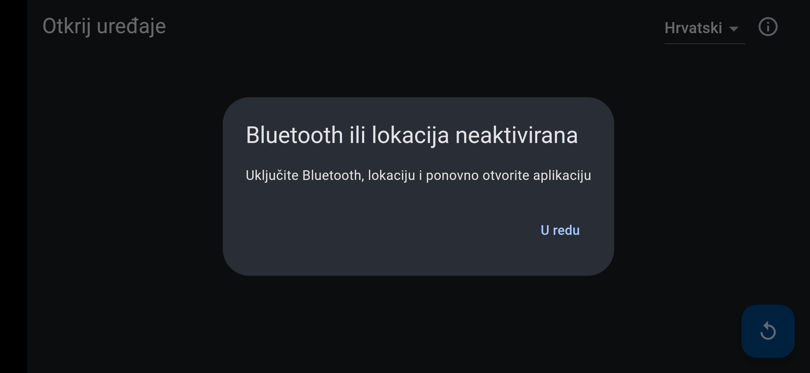
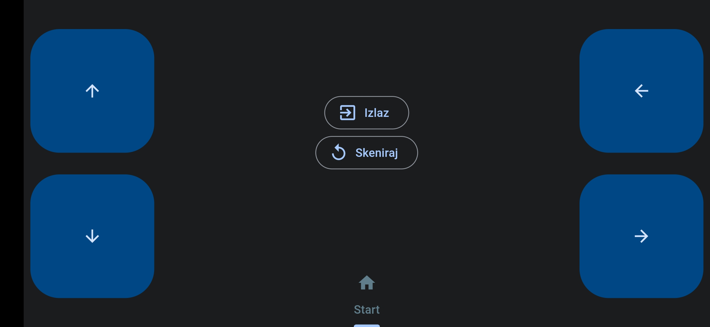
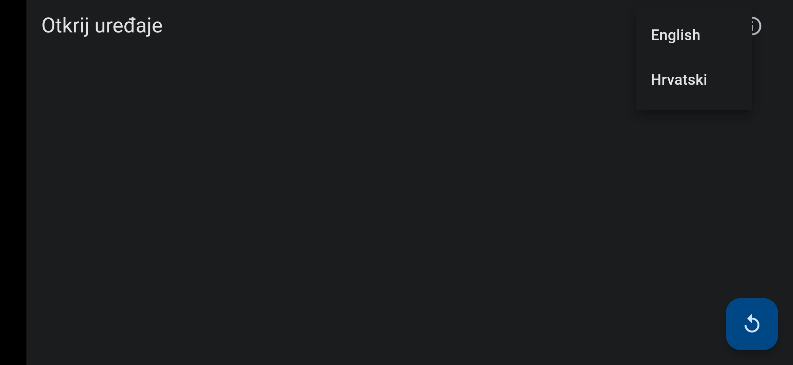
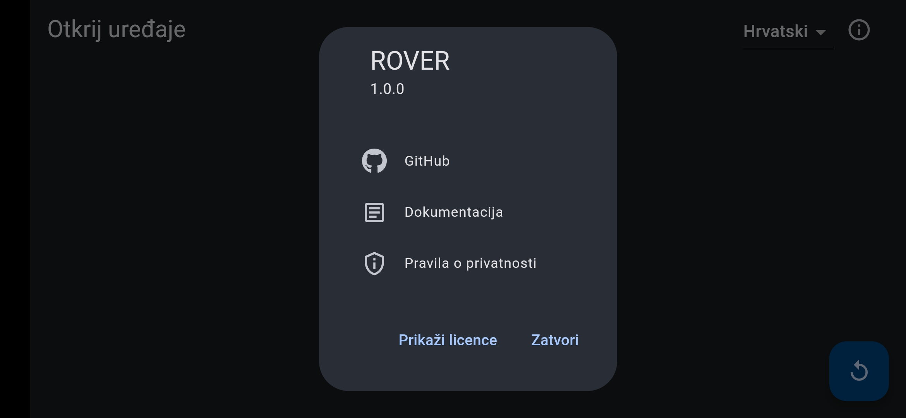
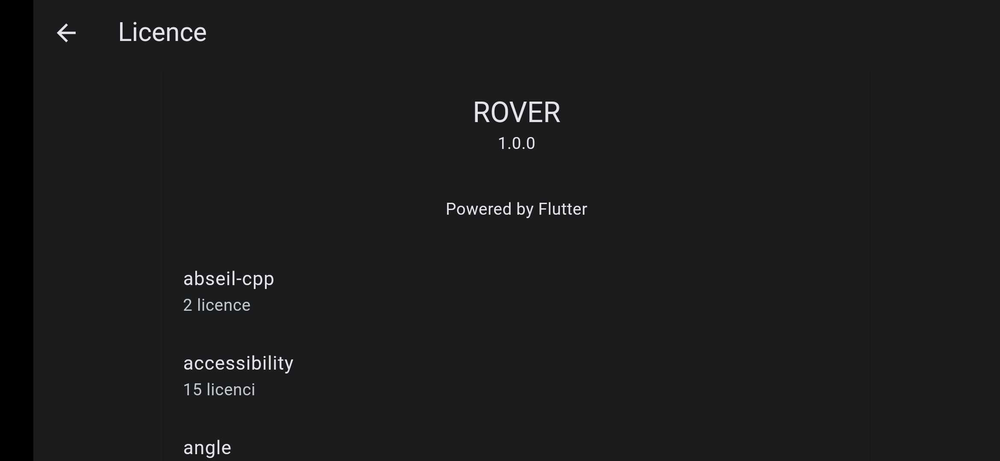
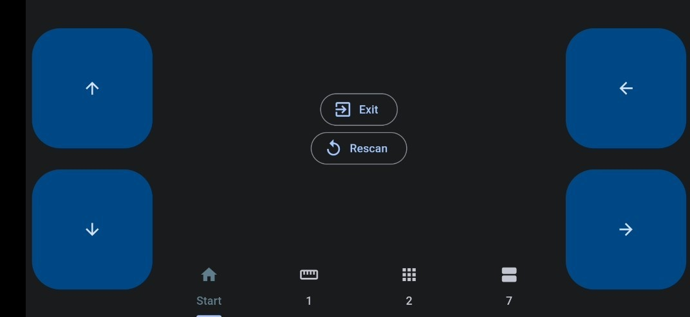
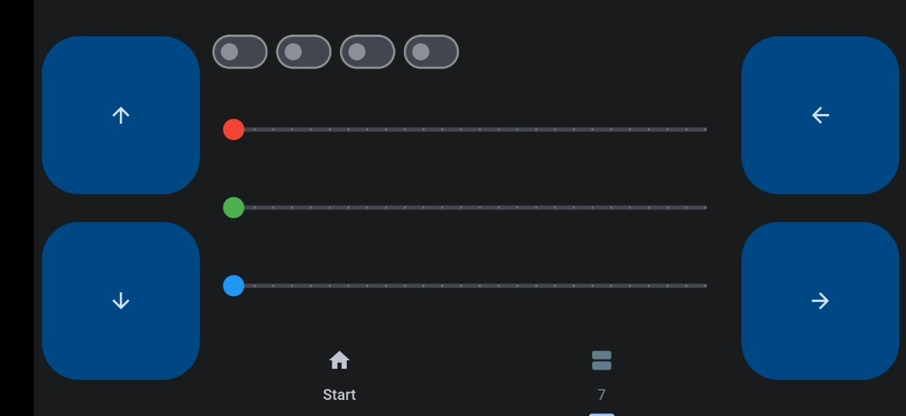
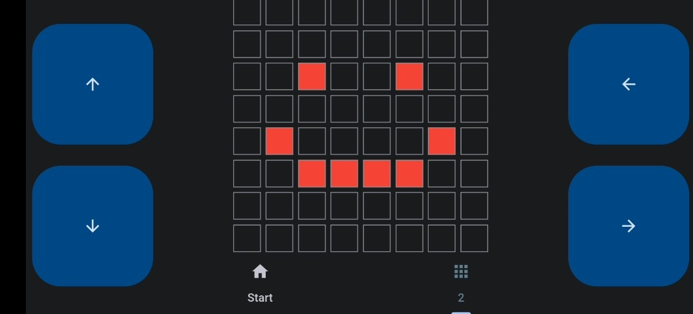
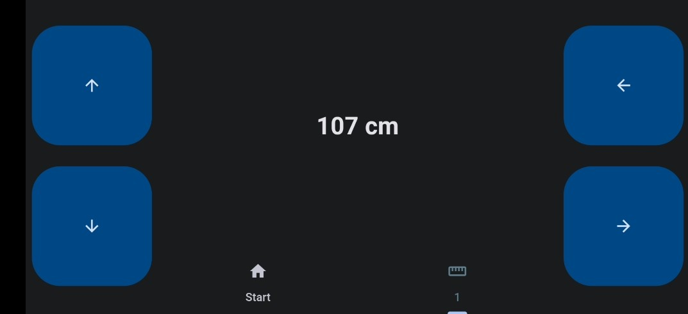
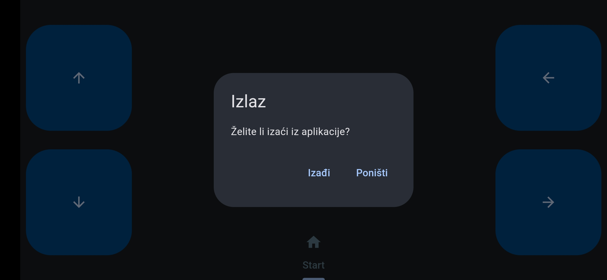

# Način rada

## Paljenje i spajanje aplikacije i vozila

Prije pokretanja aplikacije, uključite Bluetooth i lokacijske usluge na vašem uređaju kako bi aplikacija pravilno funkcionirala. Ukoliko neki od navedenih servisa nije aktiviran, pojavit će se upozorenje, a aplikacija će se ugasiti.

Nakon što omogućite pristup Bluetooth-u i lokaciji, aplikacija će započeti pretragu za ROVER-om. Pritiskom na gumb pokrećemo skeniranje uređaja, što omogućuje prikaz svih dostupnih uređaja s kojima se možemo povezati. Odaberite ROVER i nakon uspješnog spajanja, ekran će se prebaciti na upravljačko sučelje.

## Mjenjanje jezika te informacije o aplikaciji

Pritiskom na meni možete odabrati jezik sučelja. Trenutno je aplikacija prevedena na hrvatski i engleski, no zbog svoje jednostavne arhitekture, omogućeno je dodavanje još jezika.

Pritiskom na gumb u gornjem desnom kutu (info) prikazat će se informacije o aplikaciji, uključujući verziju, linkove do GitHub repozitorija, web verzije dokumentacije, pravila o privatnosti te licence. U licencama su navedeni svi paketi i programi koji su korišteni pri stvaranju aplikacije.

U licencama su navedeni svi paketi i programi koji su korišteni pri stvaranju aplikacije.

## Upravljanje ROVER-a te skeniranje

Na slici je prikazano upravljačko sučelje za ROVER. Sa lijeve i desne strane su postavljeni gumbi koji služe za pokretanje ROVER-a. U sredini se nalaze upravljačke ploče modula (u daljnjem tekstu nazvane panelima). Uvijek postoji osnovni panel koji služi za skeniranje ROVER modula. Kada se na tom panelu pritisne gumb „Skeniraj“ (Rescan), ROVER ponovno skenira i prikaže sve spojene module. Spojene module prikazuje u novim karticama, a kada se odabere neka od njih pritiskom na njihovu ikonu, panel se promjeni za taj određeni modul.

Ovako izgleda ekran s 3 spojena modula:

## Moduli

Trenutno postoje tri modula, ali ih se planira napraviti još. Ti moduli su: “Demo modul”, “Ultrasonični modul” i “Matrix modul”.

### Demo modul

Demo modul sadrži diode i zvučnicu koje se kontroliraju. Na sučelju aplikacije postoje kontrole za svaku navedenu komponentu. Prekidači upravljaju jednobojnim diodama, dok klizači upravljaju bojom RGB diode. Zadnji prekidač upravlja zujalicom. Pritiskom na te određene komponente grafičkog sučelja upravljate Demo modulom.

### Matrix modul

Sadrži matrix ekran prikazan u grafičkom sučelju kao 8x8 tablica. Pritiskom na određeno polje slika na mobilnoj aplikaciji se iscrtava na ROVER modulu. Kada se prebacite na drugi modul, stanje Matrix modula ostaje nepromijenjeno.

### Ultrasonični modul

Prikazuje udaljenost od neke prepreke u centimetrima.

## Izlazak iz aplikacije

Pritiskom na gumb `Izlaz` (`Exit`) se prikazuje upit za potvrdu za izlazak iz aplikacije.

