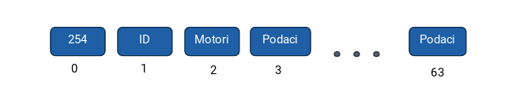
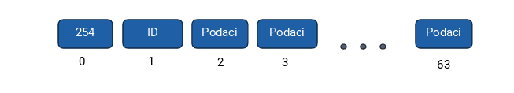
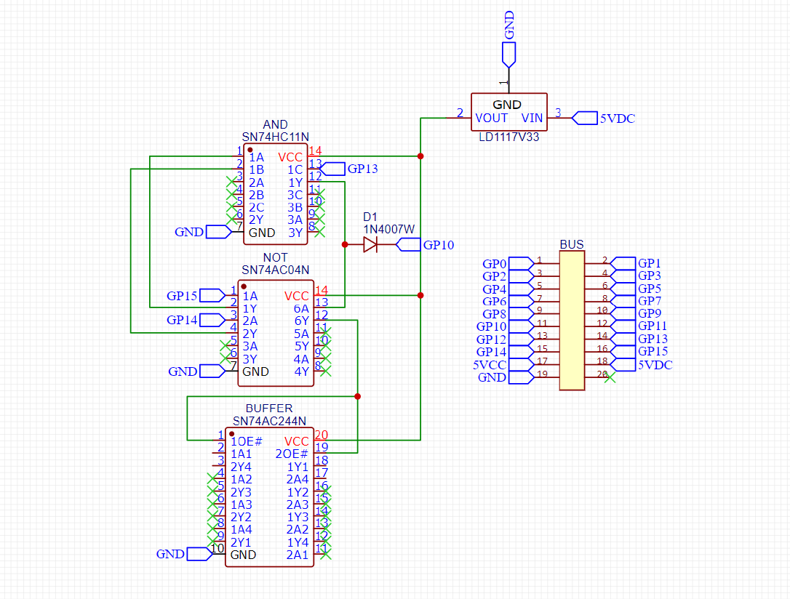

# Stvaranje modula

## Osnove komuniciranja

U komuniciranju se koristi bluetooth classic. Za komunikaciju između HC-05 i mikroupravljača koristi se UART protokol. U oba smjera se šalje niz podataka s dogovorenim mjestima.

Podaci koji se šalju s aplikacije mikroupravljaču:



254 označava početak poruke, ID označava koji modul se koristi ili koja glavna akcija se događa. Podatak motori sadrži broj u kojem pozicija bita označava je li pojedinačan gumb smjera pritisnut ili ne. Ostalo su podaci za modul.

Podaci koji se šalju s mikroupravljača prema aplikaciji:



ID označava koji modul šalje podatak, a sve ostalo su podaci koje modul šalje.

## Funkcije za komunikaciju u Flutter aplikaciji

### `void messageReaction(List<int> message);`

Funkcija koja je potrebna modificirati se ako modul ima povratnu poruku (npr. Ultrasonični modul)

```dart
/// Pridruži funkcije zadanom ID-u i modulu
///
/// Na osnovu prvog polja biti će drugačija reakcija
/// Reakcija se dodaje samo modulima koji imaju povratnu poruku roveru
void messageReaction(List<int> message) {
    switch (message[0]) {
        case 1:
            /// Ultrasonic modul
            ultrasonicModuleProvider.getDistance(message);
            break;
        case 2:
            /// Matrix modul
            /// Nema povratnu informaciju
            break;
        case 3:
            /// ID je neiskorišten
            break;
        case 4:
            /// ID je neiskorišten
            break;
        case 5:
            /// ID je neiskorišten
            break;
        case 6:
            /// ID je neiskorišten
            break;
        case 7:
            /// Demo modul
            /// Nema povratnu informaciju
        break;
            case 17:
            /// Ponovno skeniranje
            _panelsProvider.updateLists(message);
            break;
        default:
            dev.log('no case');
            break;
        }
        notifyListeners();
    }
```

Ako želite da vaš željeni modul daje podatke i aplikacija reagira, stavite dodatak koda u određeni slučaj.

### `changeDataForModule(List<int> list);`

Mijenjanje podataka koja se šalje za modul. Podaci su izraženi u listi.

```dart
/// Promjeni [dataForModule]
///
/// Promjeni samo dio koji se ondosi na podatke za modul
void changeDataForModule(List<int> list) {
    for (int i = 0; i < list.length; i++) {
        dataForModule[i] = list[i];
    }
}
```

### `sendMessage({bool changingModule = false});`

Šalje podatke koji se nalaze u dataForModule. Sadrži opcionalni argument changingModule, koji je na početku netočan.

```dart
/// Pošalji poruku roveru
void sendMessage({bool changingModule = false}) async {
    sending = true;
    Uint8List message;
    if (!changingModule) {
        message = Uint8List.fromList([254, mode, motorControl] + dataForModule);
    } else {
        message = Uint8List.fromList(
            [254, 19, motorControl, mode] + List.filled(61, 0));
    }
    dev.log('$message');
    try {
        connection!.output.add(message);
        await connection!.output.allSent;
    } catch (e) {
        dev.log('Catch in: void sendMessage()');
    }
    sending = false;
}
```

## Funkcije za komunikaciju za mikroupravljač

### `void response();`

```c
void response() {
    gpio_put(25, uart_data_waiting);
    motor_driver(input_buffer[1]);
    switch (input_buffer[0]) {
    case 0:
        // neutral
        break;
    case 1:
        // ultrasonic_module
        ultrasonic_module_reaction();
        bluetooth_send();
        break;
    case 2:
        // matrix_module
        matrix_module_reaction();
        break;
    case 3:
        // ID nije korišten
        break;
    case 4:
        // ID nije korišten
        break;
    case 5:
        // ID nije korišten
        break;
    case 6:
        // ID nije korišten
        break;
    case 7:
        // demo_module
        demo_module_reaction();
        break;
    case 18:
        // rescan
        scan_for_modules();
        send_return_message();
        break;
    case 19:
        // Promjena modula
        set_module_id(input_buffer[2]);
        module_setup(input_buffer[2]);
        break;
    default:
        break;
    }
}
```

### `uint8_t* get_input_buffer()`

Pristup svim podacima koji su poslani od strane aplikacije.

```c
uint8_t* get_input_buffer() {
    return input_buffer;
}
```

### `uint8_t* get_output_buffer()`

Pristup i postavljanje svih podataka podacima koji će se slati aplikaciji.

```c
uint8_t* get_output_buffer() {
    return output_buffer;
}
```

## Stvaranje dodatka u Flutter aplikaciji

Sav kod koji je potreban se nalazi u lib mapi. UI koji napravite stavite u mapu `lib/panel_screens/screens`. Sva dokumentacija za stvaranje UI-a je na službenim stranicama Fluttera. Ovo je primjer jednostavnog UI-a u Flutteru.

```dart
import 'package:flutter/material.dart';
import 'package:provider/provider.dart';
import 'package:rover_app/providers/modules/ultrasonic_module_provider.dart';
import 'package:rover_app/providers/panels.dart';
/// UI ultrasonic modula
/// Sadrži prikaz podataka senzora udaljenosti
/// Koristi [UltrasonicModuleProvider]
class UltrasonicModulePanel extends StatelessWidget {
    const UltrasonicModulePanel({super.key});
    @override
    
    Widget build(BuildContext context) {
    // Ova linija je bitna, ona označava koji je ovo ID
    Provider.of<Panels>(context, listen: false).changeToModule(context, 1);
    
    return Consumer<UltrasonicModuleProvider>(
        builder: (context, provider, child) {
            return Center(
                child: Text('${provider.distance} cm',
                style: const TextStyle(fontSize: 30, fontWeight: FontWeight.bold)));
        });
    }
}
```

Što se upravljačkog djela koda ona se kontrolira providerom. Provider je upravljač stanja u Flutteru i jednostavno se koristi. Te datoteke se stavljaju u mapu `lib/providers/modules`.

```dart
import 'package:flutter/material.dart';
import 'package:rover_app/providers/bt_controller.dart';
/// Demo modul provider
///
/// Sadrži jedan ultrasonic modul
/// Šalje i prima podatke
/// Šalje u formatu
/// [trig]
/// Prima u formatu
/// [prvi broj][drugi broj]
/// udaljenost = prvi broj + drugi broj
class UltrasonicModuleProvider extends ChangeNotifier {
    int distance = 0;
    void getDistance(List<int> inputBuffer) {
        distance = inputBuffer[1] + inputBuffer[2];
        notifyListeners();
    }

    /// Pokreće funkciju koje je aktivna u pozadini cijelo vrijeme
    /// Svake pola sekunde pošalji ping za osvježavanje udaljenosti ako je
    /// odabran taj modul
    void startUltrasonicService(BtController bt) async {
        while (true) {
        await Future.delayed(const Duration(milliseconds: 2500), () {
            if (bt.mode == 1) {
                bt.sendMessage();
            }
        });
        }
    }
}
```

Nakon što napišete ta dva djela, morate ih dodati u program. Zato dodajemo provider i UI u nekoliko dijelova koda:

`main.dart`
```dart
void main() {
    WidgetsFlutterBinding.ensureInitialized();
    SystemChrome.setEnabledSystemUIMode(SystemUiMode.immersiveSticky);
    /// Provideri za module (dodajte ako mislite napraviti modul)
    DemoModuleProvider demoModuleProvider = DemoModuleProvider();
    UltrasonicModuleProvider ultrasonicModuleProvider =
    UltrasonicModuleProvider();
    MatrixModuleProvider matrixModuleProvider = MatrixModuleProvider();
    /// ---------------------
    /// Provideri za panele i Bluetooth
    Panels panels = Panels();
    BtController btController =
    BtController(panels, demoModuleProvider, ultrasonicModuleProvider, matrixModuleProvider);
    ///                                             ^
    ///                                        Novi provider
    
    /// ...
    
    /// Paljenje aplikacije i postavljane je horizontalno
    SystemChrome.setPreferredOrientations([
        DeviceOrientation.landscapeRight,
        DeviceOrientation.landscapeLeft,
    ]).then((value) {
        [
        Permission.location,
        Permission.bluetooth,
        Permission.bluetoothConnect,
        Permission.bluetoothScan
        ].request().then((status) {
            runApp(MultiProvider(providers: [
            ChangeNotifierProvider(create: (_) => btController),
            ChangeNotifierProvider(create: (_) => panels),
            ChangeNotifierProvider(create: (_) => demoModuleProvider),
            ChangeNotifierProvider(create: (_) => ultrasonicModuleProvider), /// <- Novi provider
            ChangeNotifierProvider(create: (_) => matrixModuleProvider)
        ], child: const MainApp()));
    });
```

`panels.dart`

```dart
final Map<int, StatelessWidget> moduleById = {
    16: const MainPanel(),
    1: const UltrasonicModulePanel(), /// <- Novi panel
    2: const MatrixModulePanel(),
    7: const DemoModulePanel()
};
```

`bt_controller.dart`

```dart
BtController(
    this._panelsProvider,
    this.demoModuleProvider,
    this.ultrasonicModuleProvider, /// <- Novi provider
    this.matrixModuleProvider,
) {
    services();
/// ...
```

## Stvaranje dodatka za mikroupravljač

Dodatak za mikroupravjač je lakše dodavati negu u Flutteru, kod se stavlja u src mapu, i doda linija u `CMakeLists.txt`

```cmake
cmake_minimum_required(VERSION 3.13)
include(pico_sdk_import.cmake)
project(rover-pico C CXX ASM)
set(CMAKE_C_STANDARD 11)
set(CMAKE_CXX_STANDARD 17)
pico_sdk_init()

# sve nove datoteke se dodaju u add_executable
add_executable(main
src/main.c
src/bluetooth.c
src/system_manager.c
src/demo_module.c
src/ultrasonic_module.c
src/matrix_module.c
)

pico_enable_stdio_usb(main 1)
pico_enable_stdio_uart(main 1)

target_link_libraries(main pico_stdlib hardware_pwm hardware_gpio hardware_spi hardware_timer
pico_multicore)

pico_add_extra_outputs(main)
```

Primjer stvaranja modula:

`ultrasonic_module.c`

```c
#include "demo_module.h"

#define PWM_MAX_LEVEL 255

void init_demo_module(){
    // Buzzer
    gpio_set_dir(7, GPIO_OUT);

    // LED 1-3
    gpio_set_dir(3, GPIO_OUT);
    gpio_set_dir(4, GPIO_OUT);
    gpio_set_dir(5, GPIO_OUT);

    // LED RGB
    init_pwm(0);
    init_pwm(1);
    init_pwm(2);
}

void demo_module_reaction() {
    // [mode][id][motor][led1][led2][led3][R][G][B][BUZZER]
    //    0    1    2      3    4     5    6  7  8    9

    uint8_t *message = get_input_buffer();

    gpio_put(3, message[2]);
    gpio_put(4, message[3]);
    gpio_put(5, message[4]);
    
    gpio_put(7, message[8]);

    uint8_t R = message[5];
    uint8_t G = message[6];
    uint8_t B = message[7];
    
    set_pwm(0, R / 255.0);
    set_pwm(1, G / 255.0);
    set_pwm(2, B / 255.0);
}

// Inicijalizacija PWM-a
void init_pwm(uint8_t gpio) {
    uint slice_num = pwm_gpio_to_slice_num(gpio);
    pwm_config config = pwm_get_default_config();

    pwm_config_set_wrap(&config, PWM_MAX_LEVEL);
    pwm_init(slice_num, &config, true);
    gpio_set_function(gpio, GPIO_FUNC_PWM);
}

// Postavi PWM
void set_pwm(uint8_t gpio, float duty_cycle) {
    uint slice_num = pwm_gpio_to_slice_num(gpio);
    uint pwm_level = (uint)(duty_cycle * PWM_MAX_LEVEL);
    pwm_set_gpio_level(gpio, pwm_level);
}
```

`ultrasonic_module.h`

```h
#ifndef DEMO_MODULE_H_
#define DEMO_MODULE_H_

#include <stdlib.h>
#include "pico/stdlib.h"
#include "hardware/gpio.h"
#include "hardware/pwm.h"
#include "bluetooth.h"

void init_demo_module();
void demo_module_reaction();
void init_pwm(uint8_t gpio);
void set_pwm(uint8_t gpio, float duty_cycle);

#endif // DEMO_MODULE_H_
```

`bluetooth.c`

```c
void response() {
    gpio_put(25, uart_data_waiting);
    motor_driver(input_buffer[1]);
    switch (input_buffer[0]) {
        case 0:
            // neutral
            break;
        case 1:
            // ultrasonic_module
            ultrasonic_module_reaction();   // <- dodana funkcija za obradu podataka
            bluetooth_send();               // <- funkcija slanja podataka
            break;
        case 2:
            // matrix_module
            matrix_module_reaction();
            break;
        case 3:
            // ID nije korišten
            break;
        case 4:
            // ...
```

## Stvaranje PCB-a

Ovako bi izgledao osnovni dio modula, Ovo je primjer za ID 1 (prouči NOT gate). Putem Buffera se kontroliraju komponente. 3 integrirana kruga kontroliraju protok podataka prema ostalim komponentama.


