# Tehnička dokumentacija

## Softver

### Lista značajki aplikacije

#### Početni ekran

- Skeniranje i spajanje s vozilom
- Prikaz informacija o aplikaciji
- Prijevod

#### Upravljanje

- Skeniranje spojenih modula
- Upravljanje kretanja vozila
- Upravljanje različitih modula

#### Moduli

##### Demo modul

- Upravljanje 3 jednobojne LED diode
- Upravljanje RGB diode
- Upravljanje zujalice

##### Matrix modul

- Upravljanje matrix ekrana aplikacijom i serijskim prijenosom
- Crtanje oblika na matrici

##### Ultrasonični modul

- Ulazno izlazna mogućnost podataka
- Prikaz udaljenosti

### Sistemska konfiguracija

Neće svi uređaji biti u stanju upotrebljavati ovu aplikaciju. Navedeno je više sistemskih konfiguracija, jedna za mobitele te je jedna za računala. Konfiguracija za računala je potrebna samo ako mislite stvarati module.

#### Preporučena sistemska konfiguracija za mobilne uređaje

- Mobilni uređaj ili tablet s operacijskim sustavom Android
- RAM memorija 4 GB
- 30 MB slobodnog prostora (1 GB slobodnog prostora za razvoj modula)
- Bluetooth Classic

#### Preporučena sistemska konfiguracija za računala

- Procesor s 4 jezgre i radnim taktom 3 GHz
- RAM memorija 8 GB
- 10 GB ili više slobodnog prostora
- Operacijski sustav Windows, Linux ili MacOS

#### Potreban  softver

##### Windows

- Android Studio
- Flutter SDK
- Raspberry Pi Pico C/C++ SDK
- Visual Studio Code

##### Linux

- Android Studio
- Flutter SDK
- Raspberry Pi Pico C/C++ SDK
- Visual Studio Code
- CMake
- GNU GCC

##### MacOS

- Android Studio
- Flutter SDK
- Raspberry Pi Pico C/C++ SDK
- Visual Studio Code
- CMake
- GNU GCC

### Tehnologije

Projekt ROVER napravljen je pomoću više tehnologija. Odabrane su tehnologije koje su popularne, često održavane i jednostavne za naučiti. Za samu aplikaciju smo koristili Flutter. To je open-source SDK (software development kit) napravljen od strane Google-a. Koristi se za programiranje brzih cross-platform aplikacija. Unatoč tome ova aplikacija se koristi samo na android uređajima jer iOS nema mogućnost korištenja Bluetooth Classic. Za programiranje logike i UI-a se koristi Dart programski jezik. Mikroupravljač koji smo koristili je bio Raspberry Pi Pico. On ima mogućnost programirati se u Micropythonu ili C/C++ pomoću SDK-a. Odabrali smo programirati u C-u jer je to programski jezik s kojim smo upoznati i u usporedbi s Micropythonom je puno brži. GitHub koristimo za kontrolu verzije. Napravili smo organizaciju u kojoj smo stavili repozitorije projekta.

### Optimizacija

Uložen je dodatan trud u optimizaciju ROVERA, i sa strane aplikacije i mikroupravljač. Putem bluetooth-a komunicira slanjem već dogovorenim formatom poruke. Aplikacija je pisana asinkrono, što ubrzava aplikaciju posebice u djelovima slanja i primanja poruka.

### Instalacija aplikacije

Trenutno postoji dva načina za instaliranje aplikacije. Ako ne planirate nadograditi ROVER ili njegovu aplikaciju, preporučuje se preuzimanje APK datoteke s GitHub repozitorija. No, ako želite modificirati aplikaciju ili ROVER, preporučuje se kloniranje repozitorija na računalo i otvaranje projekta u razvojnom okruženju poput VSCode-a ili Android Studija. Kada je u pitanju učitavanje koda na mikroupravljač, postupak je sljedeći: klonirate repozitorij i prenesete main.uf2 datoteku na mikroupravljač. Kod se prenosi tako da tijekom spajanja Raspberry Pi Pico putem USB-a držite BOOTSEL gumb. Na računalu će se pojaviti nova jedinica za pohranu na koju ćete kopirati main.uf2 datoteku.

### Sigurnost

Sigurnost ove aplikacije je potpuno zajamčena jer ne koristi nikakve online servise. Također, i pristupni podaci i algoritmi korišteni za komunikaciju su sigurni, a provjerava se i točnost formata. U slučaju netočnih formata, neće se dogoditi nikakav neželjeni ishod. Dodatno, budući da je cijeli kod otvorenog koda (open-source), korisnici imaju potpunu transparentnost i mogu proučiti svaki dio prije instalacije.

## Hardver

### Popis djelova i tehnologija

- Mikroupravljač - Raspberry Pi Pico, koji omogućuje programiranje u C/C++
- Motor - JGA25-370 motor na 12V 100RPM x4
- Upravljač motora BTS7960B x2
- Komunikacijski modul – HC-05 (Bluetooth Classic)
- Komponente - SN74AC245N x2, SN74AC244N x1, SN74AC04N x3, SN74HC11N x3,
LD1117V33 x3, 1kΩ resistor x2, LED diode x3, header pins, LM2596 buck-converter x1,
LM2940-5 x1
- Senzori i dodatni djelovi - 8x8 Matrix, Buzzer, Ultrasonic sensor
- Napajanje 12V baterija
- 3D modeli

### Elektroničke sheme

#### Glavna shema

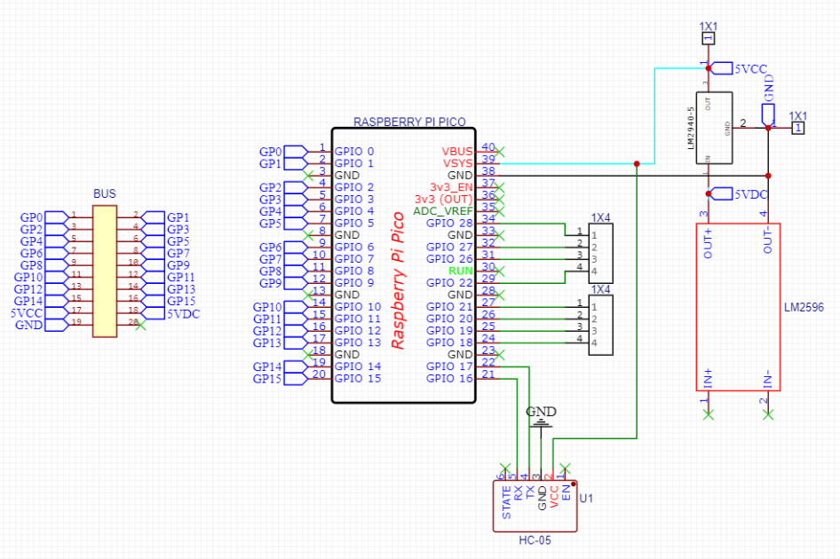

#### Demo modul

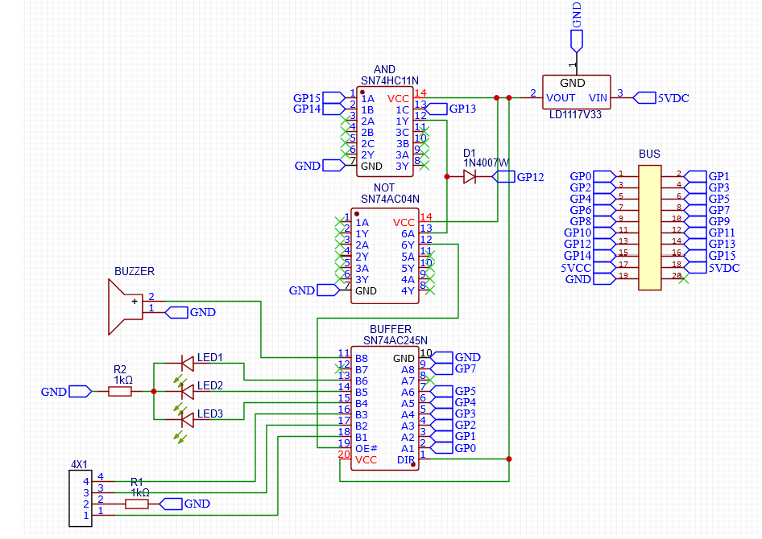

#### Matrix modul

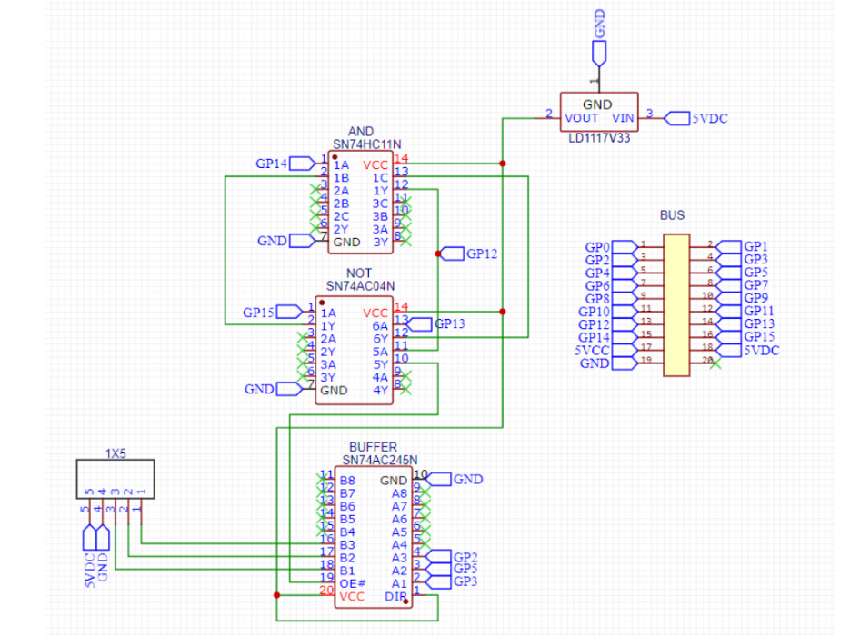

#### Ultrasonični modul

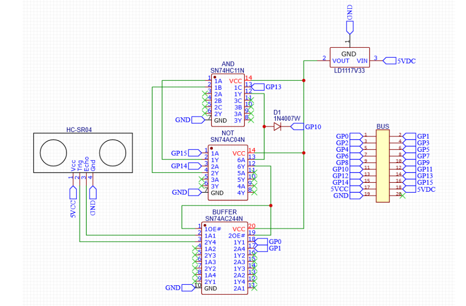

### PCB

#### Glavni PCB

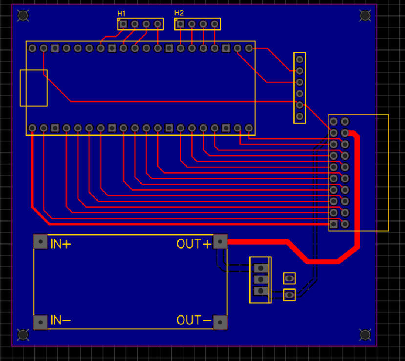

#### Demo modul

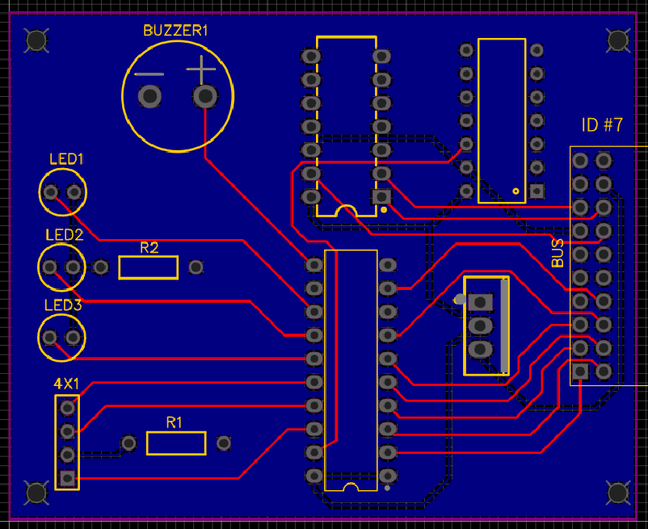

#### Matrix modul

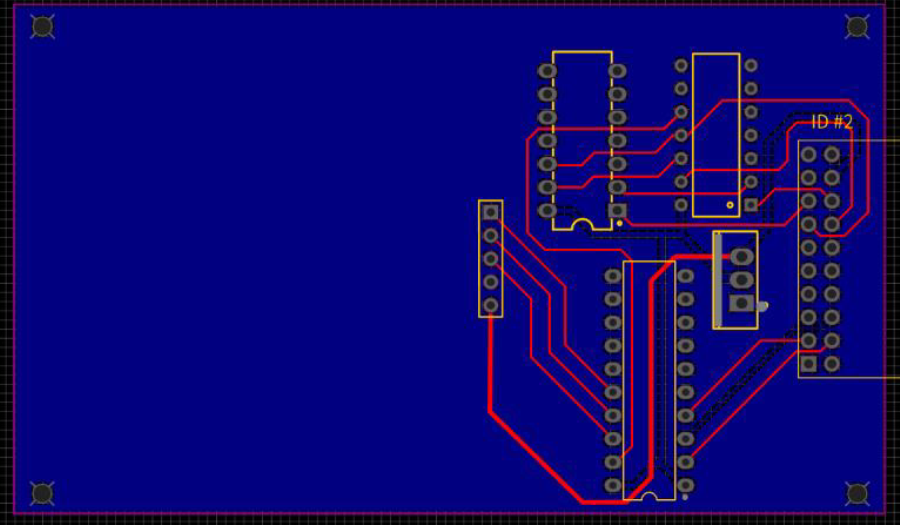

#### Ultrasonični modul

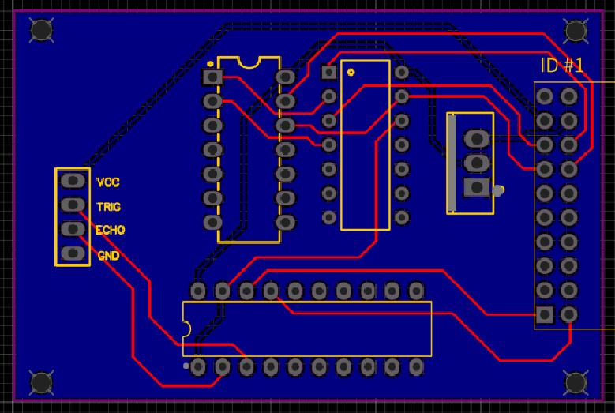

### 3D modeli

#### Rover bez modula

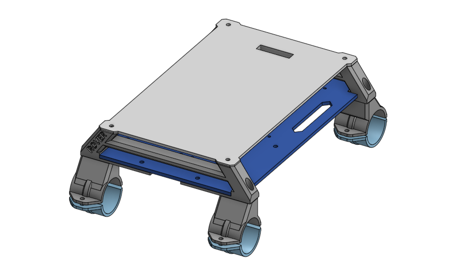

#### Rover sa modulima

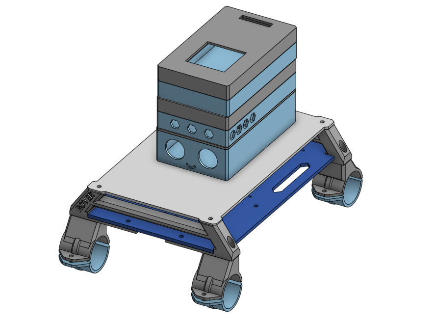

#### Ultrasonični modul

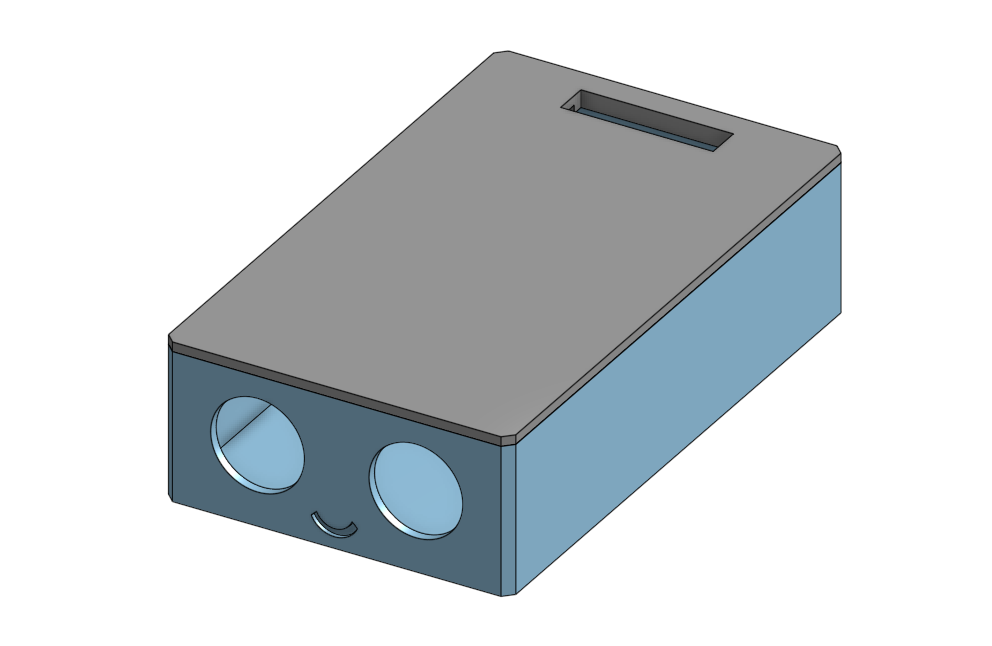

#### Demo modul

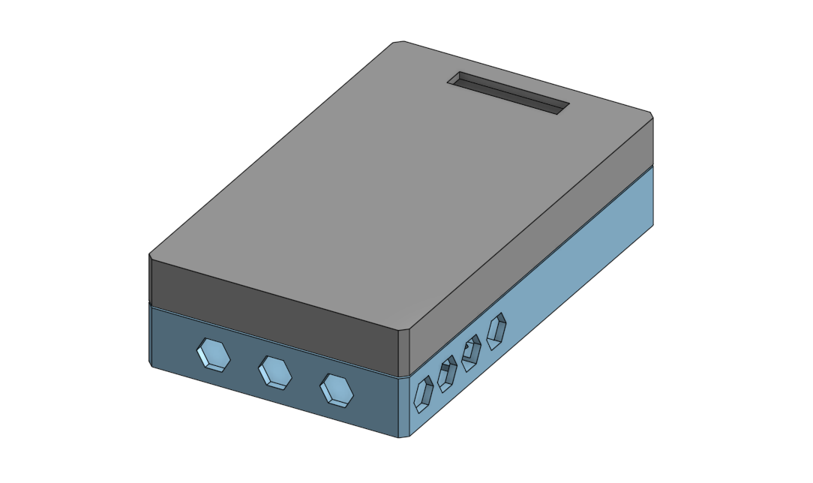

#### Matrix modul

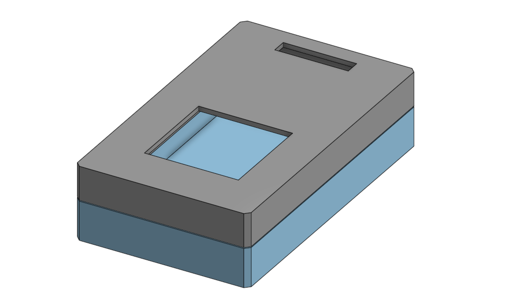

## Proces izrade

### Prva faza: izrada mobilne aplikacije

U prvoj fazi razvoja mobilne aplikacije, odlučili smo koristiti Flutter kao razvojno okruženje. Budući da Flutter ne podržava Bluetooth funkcionalnost, bili smo primorani koristiti programski paket flutter_blue_serial. Iako je to bila jedina opcija za integraciju Bluetooth Classic tehnologije, naišli smo na izazov zbog nedostatka dokumentacije. Morali smo temeljiti naše razumijevanje paketa na primjerima i vlastitom istraživanju kako bismo shvatili njegovo funkcioniranje.

Kako bismo olakšali razvoj ne samo nama već i budućim korisnicima, napisali smo funkcije za upravljanje Bluetooth vezom. Ovo je omogućilo jednostavnije implementiranje Bluetooth komunikacije u našu aplikaciju.

Za testiranje funkcionalnosti aplikacije, izradili smo malu platformu za "mock-testing". Povezali smo Raspberry Pi Pico mikroupravljač s HC-05 Bluetooth čipom i programirali ga da generira unaprijed definirane poruke i podatke. Ovo testiranje omogućilo nam je provjeru ispravnosti Bluetooth komunikacije u kontroliranom okruženju prije nego što smo se upustili u testiranje s pravim uređajima.

### Druga faza: izrada upravljačkog koda na Raspberry Pi Pico-u

U drugoj fazi razvoja, nakon što smo utvrdili da je većina funkcionalnosti aplikacije spremna za upotrebu, usredotočili smo se na pisanje upravljačkog koda za Raspberry Pi Pico. Budući da veći dio hardvera nije bio dostupan u tom trenutku, pristupili smo programiranju tako što smo kod podijelili u segmente koje smo zasebno testirali.

Ovaj pristup omogućio nam je temeljito testiranje svake komponente prije nego što smo je integrirali s ostatkom koda. Kada bismo utvrdili da određena komponenta pravilno funkcionira, izolirali bismo je od ostatka koda kako bismo osigurali njenu stabilnost i ispravnost u cjelokupnom sustavu.

Za testiranje izoliranih dijelova koda koristili smo aplikaciju koja je već bila dostupna. Ovo nam je omogućilo simuliranje stvarnog korisničkog iskustva i provjeru funkcionalnosti upravljačkog koda u kontroliranom okruženju prije nego što smo ga integrirali s ostatkom aplikacije.

### Treća faza: zrada elektroničkih shema i dizajn PCB-a

Treća faza projekta uključuje izradu elektroničkih shema i dizajn tiskanih pločica (PCB-a) koristeći platformu EasyEDA. Početak ove faze obuhvaća detaljno planiranje i skiciranje elektroničke sheme koja predstavlja logičku strukturu i povezanost svih elektroničkih komponenti u projektu.

Nakon završetka sheme, proces se nastavlja pretvaranjem shematskog prikaza u fizički dizajn PCB-a unutar iste platforme. Omogućena je automatska konverzija shematskog dijagrama u nacrt PCB-a, nakon kojeg je potrebno ručno prilagođavanje rasporeda komponenti, tragova, slojeva i drugih elemenata kako bi ostvarili traženu funkcionalnost.

Završni korak u ovoj fazi uključuje pregled i finalizaciju dizajna PCB-a, pri čemu se provjeravaju sve dimenzije, povezanosti i specifikacije komponenti kako bi se osiguralo da je sve u skladu s tehničkim zahtjevima i standardima. Nakon zadovoljavajuće provjere, dizajn se izvozi u standardnom formatu za proizvodnju, poput Gerber datoteka, koje se zatim mogu koristiti za naručivanje gotovih PCB-a od proizvođača.

### Četvrta faza: 3D modeliranje

Četvrta faza projekta obuhvaća 3D modeliranje koristeći Onshape, potpuno cloud-bazirana CAD platforma koja omogućava korisnicima izradu preciznih 3D modela komponenata i sklopova unutar samog preglednika. Proces započinje definiranjem i skiciranjem osnovnih oblika i dimenzija svih potrebnih dijelova, uključujući glavno tijelo ROVER-a, nosače, i druge strukturne elemente, a završava izvozom modela u STL formatu, koji je kompatibilan s 3D printerima.

### Završni proizvod

Kada imamo sve dijelove i potreban kod, bilo je potrebno samo složiti. Ovo je sada spremo za uporabu i daljnje modificiranje.

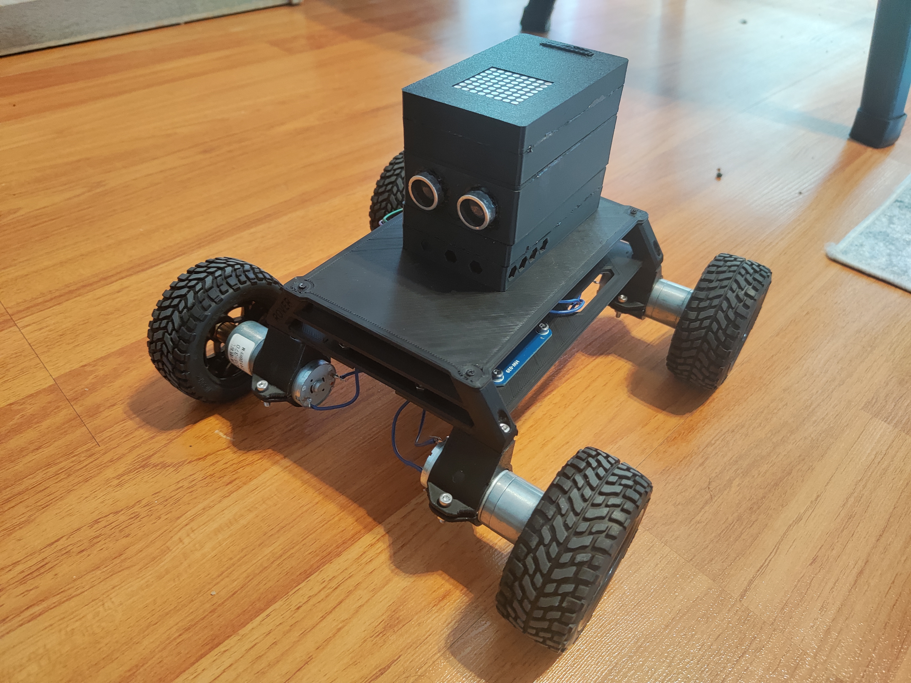

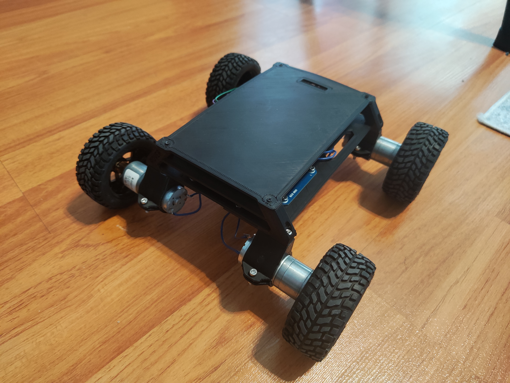

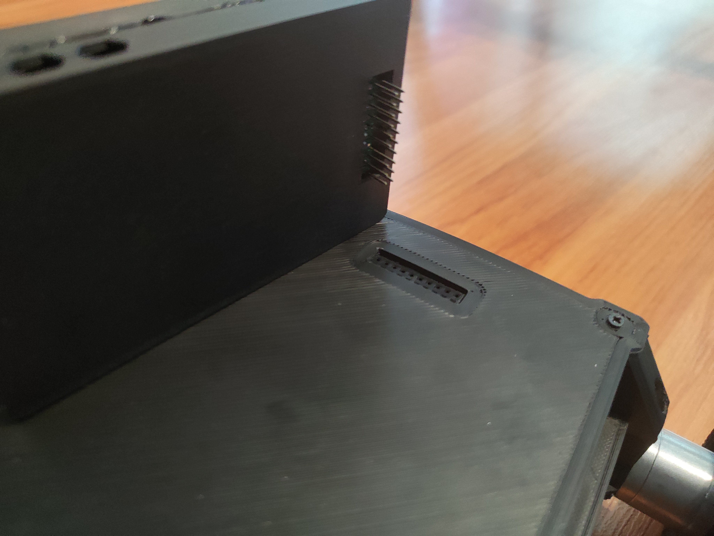

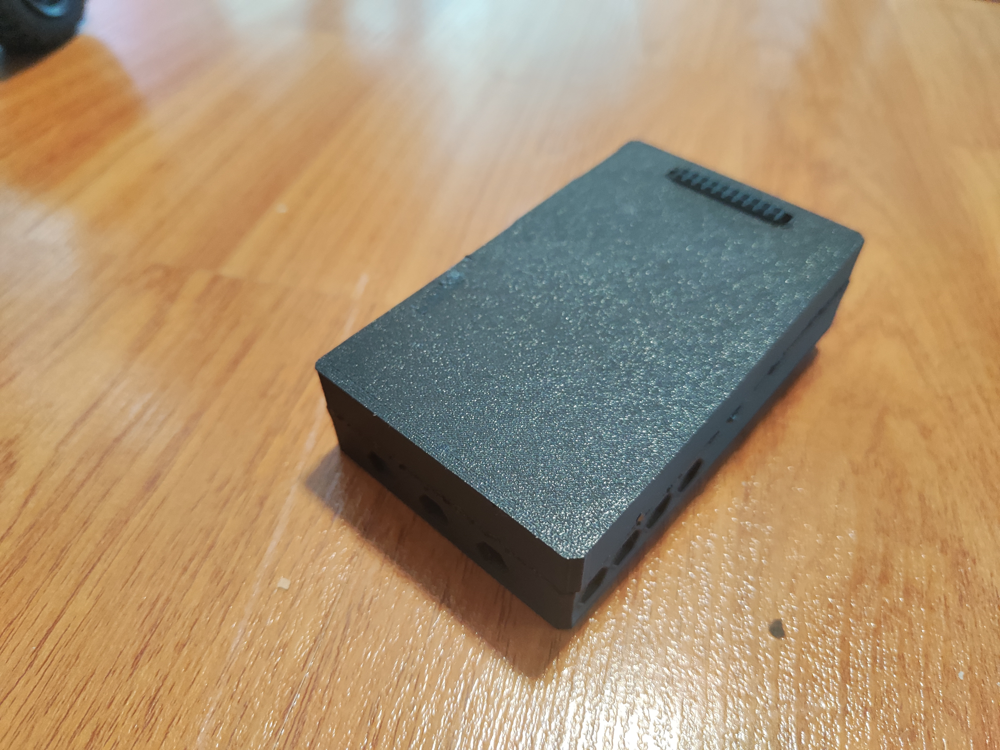

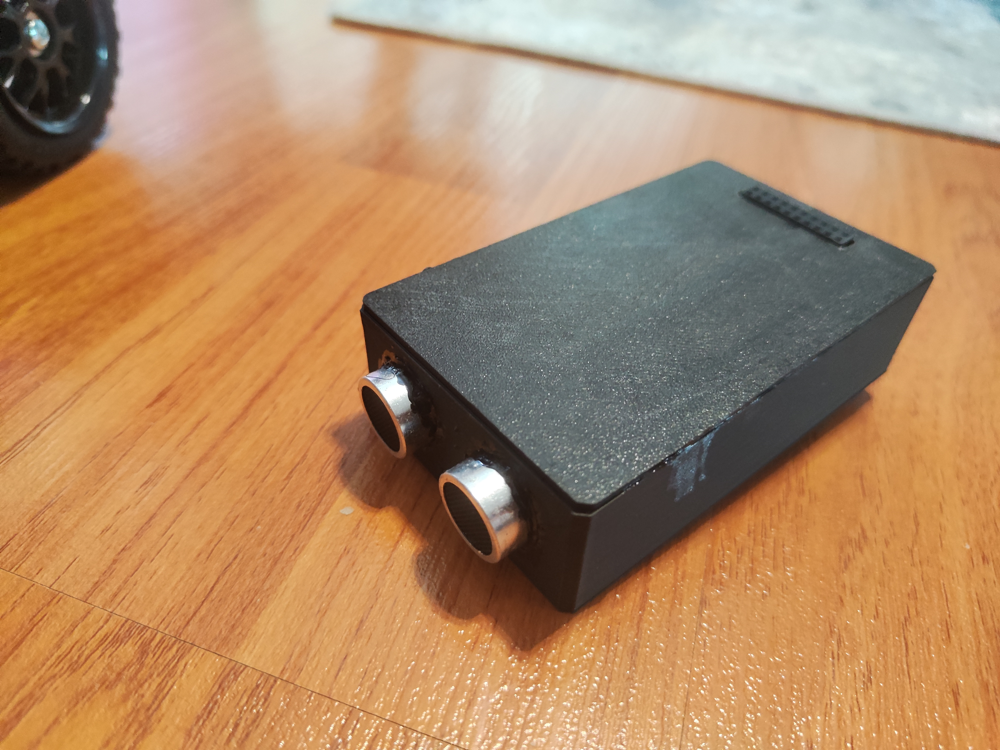
